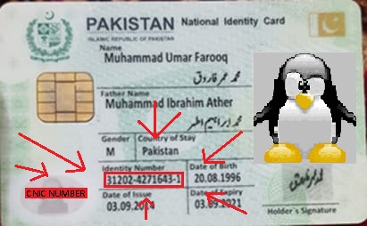

# What is CNIC ?
CNIC is 13 digit long unique identity number alotted to **Pakistani** nationality holder.
CNIC number looks like below:
```
57469-0532456-7
0975345678053
0975431479567
73654-8723402-3
2374982638947
26349-6293643-8
```
 

# How cnic exposes location and gender ?
It's not just a number. It's like a pakistani DNA or fingerprint. You can get alot information from it. 

It is in pattern `ABCDE-XXXXXXX-M`

- [`A`](#a-province) shows `PROVINCE` e.g `PUNJAB`
- `B` shows `DIVISION` e.g `SARGHODHA`
- `C` shows `DISTRICT`
- `D` shows `TEHSIL`  
- `E` shows `UNION COUNSIL`  

- `FGHIJKL` shows `FAMILY TREE`

- [`M`](#m-gender) shows `GENDER` e.g `MALE` or `FEMALE`

### A (Province)
- If A = 1 Then Resident lives in `KPK`
- If A = 2 Then Resident lives in `FATA`
- If A = 3 Then Resident lives in `PUNJAB`
- If A = 4 Then Resident lives in `SINDH`
- If A = 5 Then Resident lives in `BALOCHISTAN`
- If A = 6 Then Resident lives in `ISLAMABAD`
- If A = 7 Then Resident lives in `Gilgit-Baltistan`

[Extended details about cnic codes...](cnic_codes_list.md)

### M (Gender)
- IF M = 1 or 3 or 5 or 7 or 9 Then Resident is `MALE`
- IF M = 0 or 2 or 4 or 6 or 8 Then Resident is `FEMALE`

# Tool
I have created tiny javascript program. So no manuall work needed.
Put cnic and that tool will find and show details (location and gender) itself.
Please view: [CNIC Tracker](https://graysuit.github.io/cnic) .
